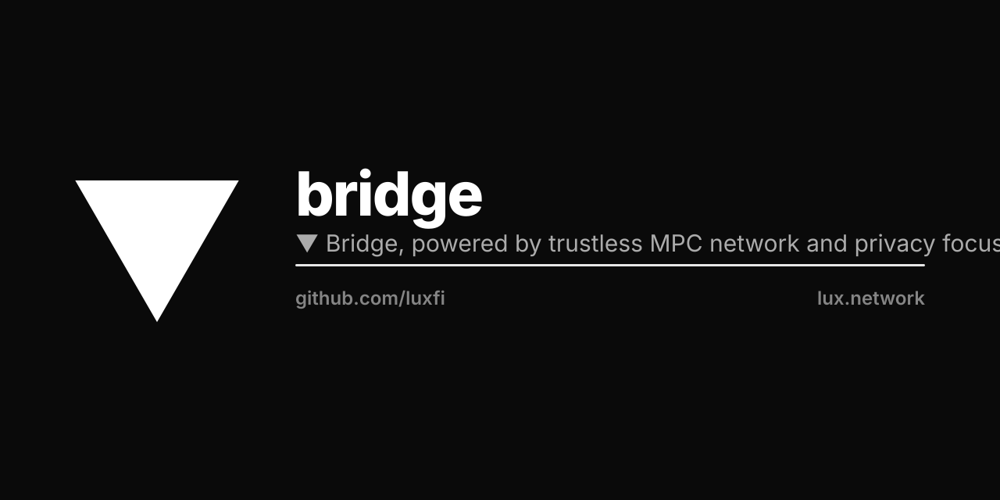

<p align="center"></p>

# Lux Bridge

Bridge monorepo for Lux Network — a decentralized cross-chain bridge using
Multi-Party Computation (MPC) for secure asset transfers.

## Embed the bridge SDK

To embed bridge.lux.network in another app, install `@luxfi/bridge`:

```bash
pnpm add @luxfi/bridge react react-dom
```

```ts
import { mountBridge } from '@luxfi/bridge'

mountBridge({
  config: {
    apiHost: 'https://api.bridge.lux.network',
    env: 'mainnet',
    brand: { name: 'Lux Bridge', primaryColor: '#0066ff' },
  },
})
```

`@luxfi/bridge` is the only package consumers import. All `@luxbridge/*`
packages are internal workspace deps and are never published.

## Package scopes

| Scope | Visibility | Role |
|---|---|---|
| `@luxfi/bridge` | public (npm) | Canonical SDK — embed bridge UI into a host app. |
| `@luxfi/core` | public (npm) | Shared types (Asset, Network, Contract, ...). |
| `@luxfi/threshold` | public (npm) | T-Chain MPC threshold-signature SDK. |
| `@luxfi/utila` | public (npm) | Utila protobuf client. |
| `@luxbridge/lux-tenant` | private (workspace) | Slim Vite SPA for bridge.lux.network — consumes `@luxfi/bridge`. |
| `@luxbridge/settings` | private (workspace) | Network + asset registry. |
| `@luxbridge/explorer` | private (workspace) | On-chain explorer UI. |
| `@luxbridge/server` | private (workspace) | Bridge API daemon. |
| `@luxbridge/ui-automation` | private (workspace) | Selenium UI test harness. |

One canonical SDK name. One mount function. One config shape.

## Prerequisites

- Node.js v20+
- pnpm v9.15.0+
- Go 1.22+ (for MPC tools)
- Docker (for infrastructure services)

## Quick Start

### 1. Install Dependencies

```bash
# Install pnpm if needed
npm install -g pnpm

# Install project dependencies
pnpm install

# Install MPC tools via Go
make install-mpc
```

### 2. Start Infrastructure

```bash
# Start infrastructure services (Lux ID, KMS, databases, etc.)
make up
```

This starts:
- **Lux ID** (Casdoor) - Port 8000 - Unified authentication
- **KMS** (Vault) - Port 8200 - Key management
- **NATS** - Port 4223 - Messaging
- **Consul** - Port 8501 - Service discovery
- **PostgreSQL** - Port 5433 - Bridge database
- **Lux ID DB** - Port 5434 - Auth database

### 3. Start MPC Network

```bash
# Start 3-node MPC network
make start-mpc-nodes
```

This runs MPC nodes on:
- Node 0: HTTP 6000, gRPC 9090
- Node 1: HTTP 6001, gRPC 9091
- Node 2: HTTP 6002, gRPC 9092

### 4. Start Application Services

In separate terminals:

```bash
# Terminal 1: Bridge API Server
cd app/server && pnpm dev

# Terminal 2: Bridge UI
cd app/bridge && pnpm dev
```

### 5. Access Services

- Bridge UI: http://localhost:3001
- Bridge API: http://localhost:5000
- Lux ID Admin: http://localhost:8000
- Consul UI: http://localhost:8501

## Architecture

```
Tenant app (Lux, Hanzo, Zoo, …)
  imports @luxfi/bridge  +  @<org>/brand
                │
                ▼
    @luxfi/bridge (pkg/bridge)
    Bridge UI inlined under src/app/
    Direct deps: @hanzo/gui, @luxfi/threshold, wagmi, viem
                │
        ┌───────┴────────┐
        ▼                ▼
   app/server      @luxfi/threshold
   Express+Prisma  MPC SDK (also consumed by app/server)
                          │
                          ▼
                  m-chain (public MPC, 2-of-3 threshold)
                  + optional private cluster (treasury fees)
                  + optional layered cosigners (Utila / Fireblocks)
```

See [`docs/LLM.md`](docs/LLM.md) for the full topology, MPC protocol list
(`cggmp21`, `frost`, `bls`, `doerner`, `pulsar`, `corona`, `magnetar`),
layered-cosigner pattern, and explorer-migration plan.

## Key Features

- **MPC Security**: 2-of-3 threshold signatures (also PQ-safe lattice variants)
- **Layered cosigners** (since SDK v1.0.3): optional Utila / Fireblocks
  cosign on top of native MPC for institutional flows
- **Multi-Chain**: Support for EVM and non-EVM chains
- **Unified Auth**: Lux ID (Casdoor) integration
- **Key Management**: Secure key storage in KMS
- **Service Discovery**: Consul for dynamic configuration

## Development

```bash
# Run tests
pnpm test

# Check MPC status
lux-mpc-cli status --url http://localhost:6000

# View logs
tail -f logs/mpc-node-0.log

# Stop services
make stop-mpc-nodes  # Stop MPC
make down           # Stop infrastructure
```

## Documentation

- [`docs/LLM.md`](docs/LLM.md) — canonical AI/onboarding doc: architecture,
  package layout, MPC topology, runtime config, publishing status, layered
  cosigners, explorer migration plan
- [`docs/LUX-ID-INTEGRATION.md`](docs/LUX-ID-INTEGRATION.md) — Lux ID
  (Casdoor) auth integration
- [`pkg/bridge/README.md`](pkg/bridge/README.md) — consumer-facing SDK
  README (`mountBridge`, `BridgeConfig`, all config blocks)

For the new bridge dev: [issue #392](https://github.com/luxfi/bridge/issues/392)
is the entry point — read order, repo map, open issues by priority.

## Tips

Since "pnpm" is a finger twister, many people alias it to "pn". For example, with `bash`, put `alias pn='pnpm'` in `.bashrc`.
