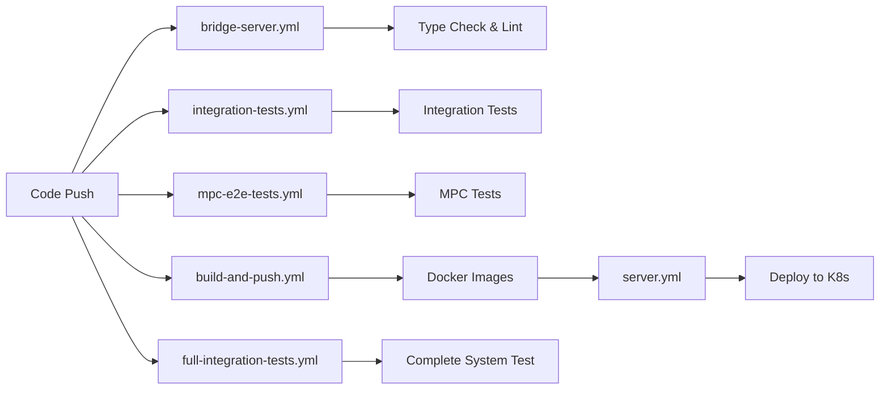

# GitHub Workflows Summary

## What Each Workflow Does

### 🔨 Build Workflows

#### **build-and-push.yml**
- **Triggers**: Push to main, PRs, manual
- **What it builds**:
  - Bridge server Docker image (multi-platform: amd64, arm64)
  - Bridge UI Docker image (multi-platform: amd64, arm64)
- **What it tests**: Nothing
- **Output**: Docker images pushed to ghcr.io/luxfi/bridge-server and ghcr.io/luxfi/bridge-ui

#### **server.yml** (Deployment)
- **Triggers**: Push to main (server changes only)
- **What it does**:
  - Builds server Docker image
  - Pushes to GitHub Container Registry
  - Deploys to Kubernetes cluster
- **What it tests**: Nothing
- **Output**: Live deployment

### 🧪 Test Workflows

#### **bridge-server.yml**
- **Triggers**: Push/PR to main/develop (server changes)
- **What it tests**:
  - TypeScript type checking
  - ESLint code quality
  - Builds server successfully
- **Missing**: Unit tests, integration tests

#### **integration-tests.yml**
- **Triggers**: Push/PR to main/develop, daily at 2 AM UTC
- **What it tests**:
  - PostgreSQL database connectivity
  - NATS messaging system
  - Consul service discovery
  - Basic API endpoints
  - Mock MPC operations
- **Services**: PostgreSQL, NATS, Consul
- **Missing**: Vault (KMS), Casdoor (ID), real MPC

#### **mpc-e2e-tests.yml**
- **Triggers**: Push/PR (MPC-related changes), manual
- **What it tests**:
  - MPC node startup (mocked)
  - NATS connectivity
  - Consul registration
  - Basic MPC operations (mocked)
- **Services**: NATS, Consul
- **Missing**: Real MPC binaries, Vault, Casdoor

#### **full-integration-tests.yml** (NEW)
- **Triggers**: Push/PR to main/develop, daily at 3 AM UTC, manual
- **What it tests**:
  - ✅ ALL services together (PostgreSQL, NATS, Consul, Vault, Redis, Casdoor)
  - ✅ Complete authentication flow
  - ✅ KMS key management
  - ✅ MPC network operations
  - ✅ Full bridge API
  - ✅ Service discovery
  - ✅ Performance benchmarks
  - ✅ Security audits
- **Special**: Most comprehensive test suite

### 📊 Current Test Coverage

| Component | Unit Tests | Integration Tests | E2E Tests |
|-----------|------------|-------------------|-----------|
| Bridge Server | ❌ | ⚠️ Partial | ⚠️ Partial |
| Bridge UI | ❌ | ❌ | ❌ |
| MPC Network | ❌ | ⚠️ Mocked | ⚠️ Mocked |
| Casdoor (ID) | ❌ | ✅ (full-integration) | ✅ (full-integration) |
| Vault (KMS) | ❌ | ✅ (full-integration) | ✅ (full-integration) |
| Database | ❌ | ✅ | ✅ |
| Message Queue | ❌ | ✅ | ✅ |
| Service Discovery | ❌ | ✅ | ✅ |

### 🔄 Workflow Dependencies



### 🚀 Workflow Execution Order

1. **On Code Push**:
   - bridge-server.yml (if server changed)
   - integration-tests.yml
   - mpc-e2e-tests.yml (if MPC changed)
   - build-and-push.yml
   - full-integration-tests.yml

2. **On Successful Build**:
   - server.yml (deploys to production)

3. **Daily**:
   - integration-tests.yml (2 AM UTC)
   - full-integration-tests.yml (3 AM UTC)

### ✅ What's Working

1. **Build Process**: All components build successfully
2. **Basic Integration**: Services connect and communicate
3. **Deployment**: Automated deployment to Kubernetes
4. **Service Mesh**: NATS, Consul working correctly
5. **Database**: PostgreSQL migrations and queries work

### ❌ What's Missing

1. **Real MPC Testing**: All MPC tests use mocks
2. **Unit Tests**: No component has unit tests
3. **UI Testing**: No frontend tests
4. **Performance Tests**: No load/stress testing
5. **Security Scans**: Limited security testing

### 🎯 Recommended Workflow Improvements

1. **Add Unit Test Workflow**
   ```yaml
   name: Unit Tests
   on: [push, pull_request]
   jobs:
     test-server:
       - Run Jest tests for server
     test-ui:
       - Run React tests for UI
   ```

2. **Add Security Workflow**
   ```yaml
   name: Security Audit
   on: [push, schedule]
   jobs:
     dependency-scan:
       - Run npm audit
       - Run Snyk scan
     container-scan:
       - Scan Docker images
   ```

3. **Add Performance Workflow**
   ```yaml
   name: Performance Tests
   on: [schedule, workflow_dispatch]
   jobs:
     load-test:
       - Run k6 or JMeter tests
       - Compare against baselines
   ```

### 📋 Quick Reference

- **Need to test a server change?** → bridge-server.yml runs automatically
- **Need to test integration?** → integration-tests.yml or trigger full-integration-tests.yml
- **Need to test MPC?** → mpc-e2e-tests.yml (but it's mocked)
- **Need to deploy?** → Push to main, server.yml handles it
- **Need full system test?** → Run full-integration-tests.yml manually

### 🔧 Manual Workflow Triggers

```bash
# Run full integration tests
gh workflow run "Full Integration Tests" --repo luxfi/bridge

# Run MPC E2E tests
gh workflow run "MPC E2E Tests" --repo luxfi/bridge

# Check workflow status
gh run list --repo luxfi/bridge --limit 5
```